### Agostina Etchebarren </br> Septiembre 2026
# Práctico Dos </br> Desarrollo Seguro de Software

### Introduccón
&emsp;Este documento contiene el desarrollo del Práctico Dos de la asignatura Desarrollo Seguro de Software. La consigna del mismo contempla la investigación, identificación y mitigación de cinco vulnerabilidades en el presente repositorio: 

**1.** Inyección SQL (SQLi). </br>
**2.** Cross Site Scripting (XSS). </br>
**3.** File Upload. </br>
**4.** Server Side Template Injection. </br>
**5.** Almacenamiento inseguro. </br>

### 1. Inyección SQL
#### 1.1 Introducción
&emsp; Las inyecciones SQL son, como indica el nombre, un tipo de ataque informático en el cual se manipula una base de datos mediante declaraciones en lenguaje SQL (Structured Query Language) por medio de puntos de acceso al servidor, como es el recibimiento de valores de parte del usuario.

&emsp; Existen inyecciones de varios tipos: basada en errores, por medio del operador UNION, inyecciones ciegas y de segundo orden.

&emsp; Para evitar estos ataques, es importante contar con un modelo RBAC (Role Based Access Control) robusto, y principalmente, sanitizar y parametrizar las cadenas que vengan del exterior del sistema. Asimismo, dar mensajes de error claros pero que no revelen información crítica del sistema y de su estructura.

&emsp; En base a estos datos, se pueden sufrir modificaciones y eliminaciones no autorizadas de la información guardada en la base de datos.

#### 1.2 Demostración de la presencia de la vulnerabilidad
&emsp; Si nos movemos dentro del directorio del primer ejercicio y corremos el comando `docker compose up --build` podremos entrar a la plataforma vulnerable corriendo en `localhost:5000`.

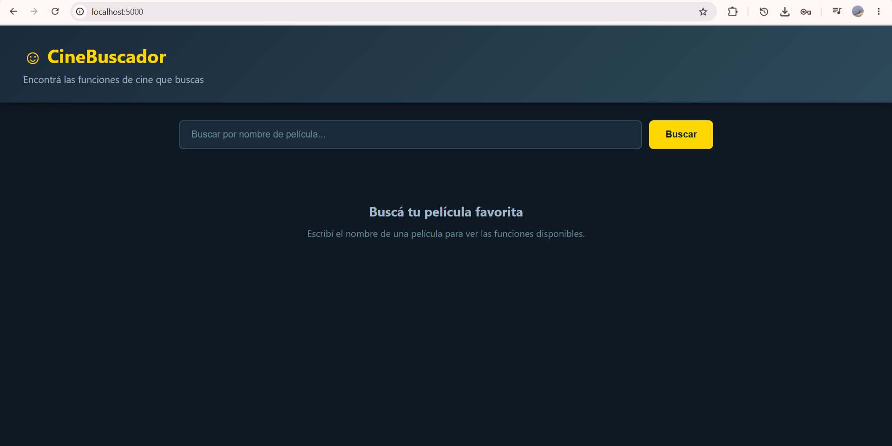
&emsp; Dentro de esta el punto de ataque claro es el buscador para películas. Si en este buscador ingresamos un ataque típico de SQL Injection, como puede ser `' OR 1=1 --`, se nos devolverá todas las funciones disponibles.

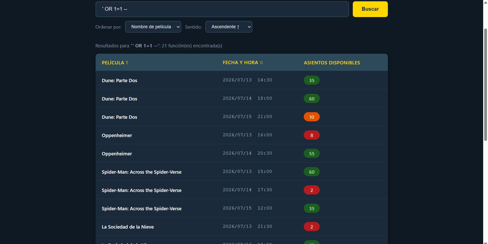
&emsp; Este ataque funciona porque la sentencia `OR 1=1` siempre es evaluada como verdadera por la base de datos. Esto se traduce a una consulta de la siguiente forma: se devolverán las funciones que coincidan con el nombre de la película ingresado (en el caso del ataque, una cadena vacía), o se devolverán las funciones si `1=1`.

#### 1.3 Análisis del código
&emsp; Si vemos el código que se encarga de buscar aquello que se coloca dentro del input, podremos ver que el método de búsqueda simplemente concatena la cadena ingresada por el usuario a la consulta SQL.

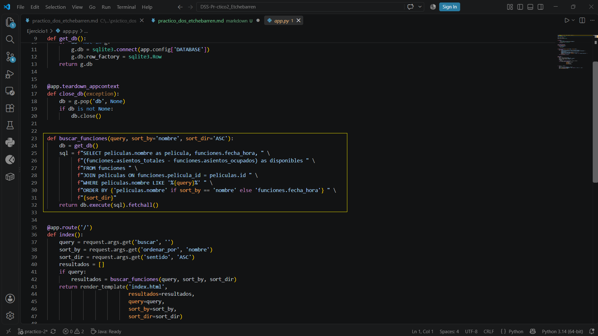
#### 1.4 Mitigación
&emsp; Para solucionar este problema, simplemente debemos parametrizar la búsqueda ingresada por el usuario. Esto se puede usar pasando como parámetro dentro del método execute de SQLite.

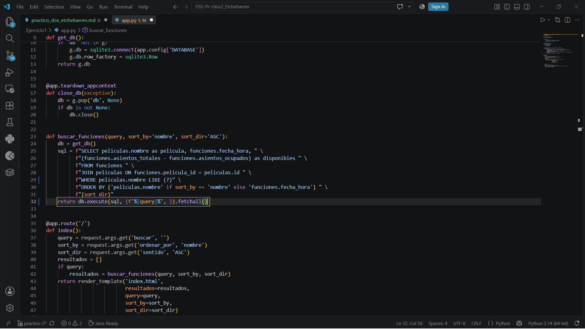
&emsp; Si guardamos los cambios e intentamos el ataque otra vez veremos esto en la página:

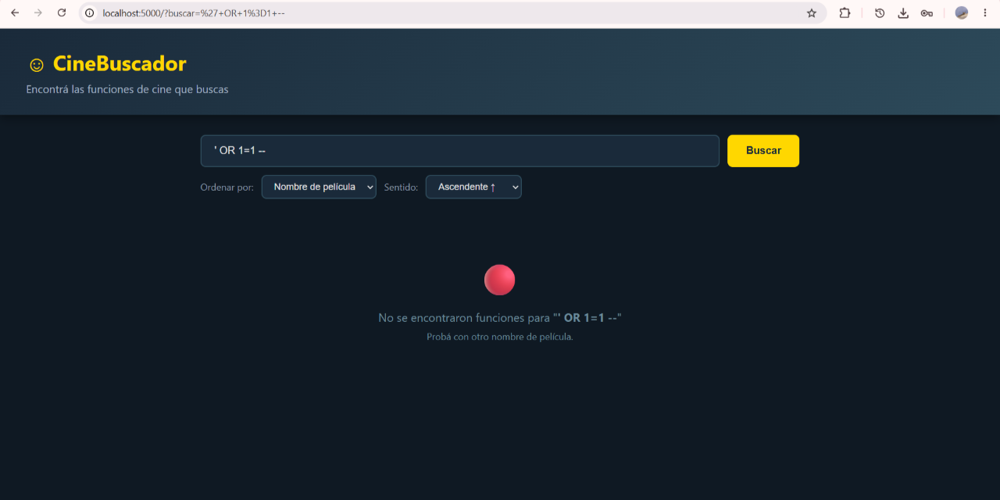

#### 1.5 Fuentes
1. https://www.trendmicro.com/es_es/what-is/cyber-attack/types-of-cyber-attacks/sql-injection-attack.html


### 2. Cross Site Scripting
#### 2.1 Introducción
&emsp; Los ataques de tipo XSS permiten que los atacantes ingresen sentencias de código malicioso, de forma que esto se ejecute y sea parte de la página.

&emsp; Este tipo de ataques puede, por ejemplo, mostrar contenido inapropiado, redirigir al usuario a páginas maliciosas sin que este lo sepa o que lo sepa y que la página imite a una de confianza, o hasta la instalación de malware en el sistema de la víctima.

&emsp; Para poder evitar este tipo de ataque, no hay que permitir la entrada de cadenas que sigan formatos HTML o JavaScript.

#### 2.2 Demostración de la presencia de la vulnerabilidad
&emsp; Si ejecutamos el programa dentro del directorio del segundo ejercicio, nos encontraremos una vez más con CineBuscador. Podemos ejecutar un ataque similar al primer ejercicio, excepto que ahora tenemos tres funciones para las cuales podemos editar su contenido.

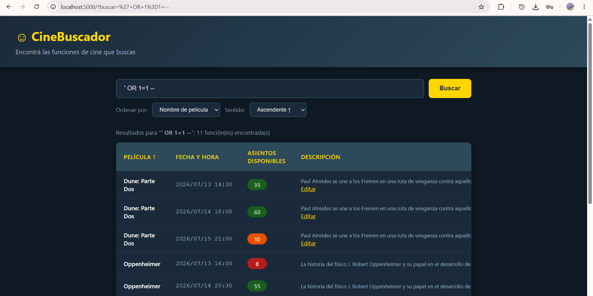

&emsp; Si entramos al panel de edición de una función cualquiera, podemos ver que se pueden editar el nombre, género, director y descripción de la película:

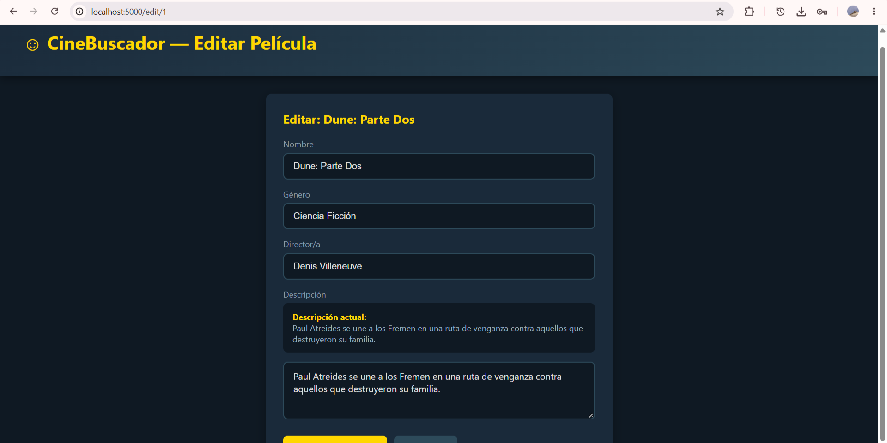

&emsp; Podemos aprovechar esto para introducir un script que redirija al usuario a otra página, por ejemplo por medio de la siguiente sentencia:
```
<img src="x" onerror="alert('Ha ocurrido un error, vuelva a autenticarse'); window.location.href='https://encrypted-tbn0.gstatic.com/images?q=tbn:ANd9GcRJt_B3p-vyn0FCyWFr2iB4FxIqyAxGyqFeAVJx6HUgYfmh2Ektd9Z_z-nV&s=10';"
```
&emsp; El payload ingresado intenta abrir un elemento de tipo imagen que no existe, lo cual activa el comportamiento especificado en caso de errores; en este caso, redirigir al usuario a otra página.

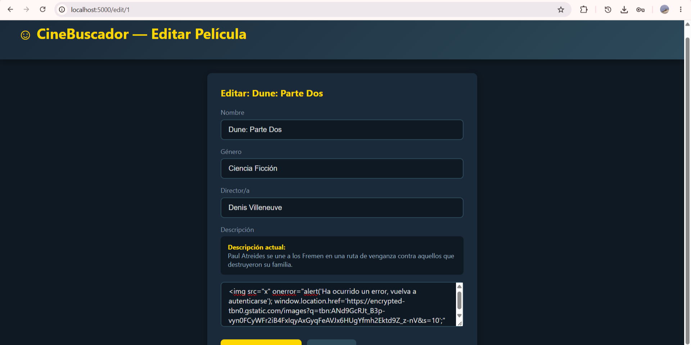
&emsp; Si intentamos entrar nuevamente a la página de edición, efectivamente se devolverá la alerta y al aceptarla se nos redirigirá al destino definido.

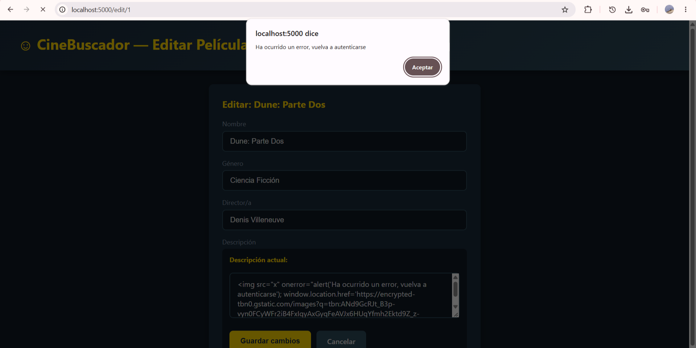


#### 2.3 Análisis del código
&emsp; Si entramos dentro del directorio del segundo ejercicio, podremos ver en primer lugar, la misma falla que encontramos en el primer ejercicio, que se soluciona de la misma manera. Por otro lado, si entramos a la plantilla usada para mostrar la plantilla de edición, vemos lo siguiente:
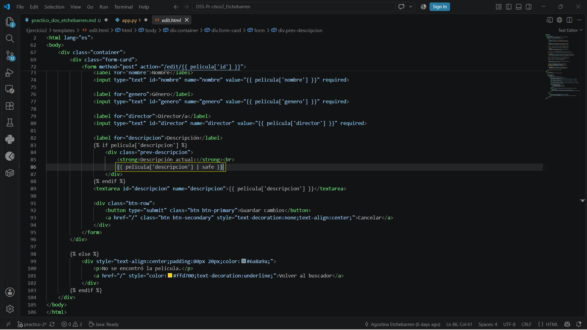
&emsp; En este caso, el filtro `safe` deshabilita el funcionamiento automático de Jinja2, el motor de plantillas de Flask, que no permite la interpretación de las cadenas del usuario como código válido.

#### 2.4 Mitigación
&emsp; Fácilmente podemos, solucionar el problema de la inyección como lo hemos visto en el punto uno, y por otro lado, eliminar el filtro `safe` del componente que muestra las descripciones.

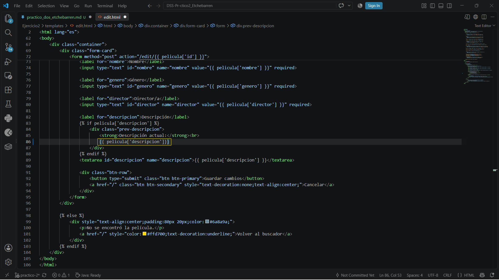
&emsp; Al intentar el ataque otra vez, aunque ingresemos el script malicioso, podremos abrir el panel de edición normalmente y no saltará ninguna alerta.

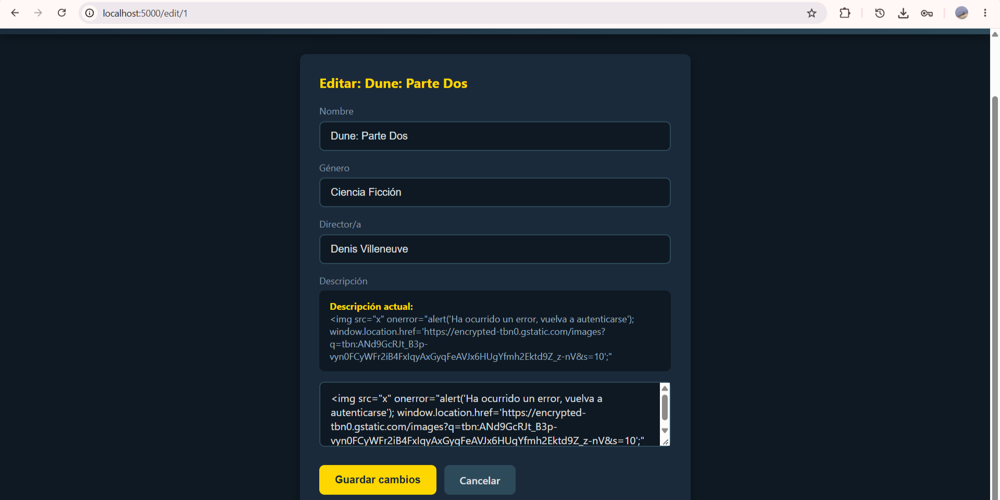

### 3. File Upload
#### 3.1 Introducción
&emsp; 

#### 3.2 Demostración de la presencia de la vulnerabilidad
&emsp;

#### 3.3 Análisis del código
&emsp;

#### 3.4 Mitigación
&emsp;


### 4. Server Side Template Injection
#### 4.1 Introducción
&emsp; SpEL (Spring Expression Language) es una funcionalidad de Spring que nos permite escribir expresiones de forma declarativa con una sintaxis específica, las cuales son llevadas a cabo en tiempo de ejecución; SpEL permite acceder a propiedades, métodos, realizar operaciones ariméticas y trabajar con  expresiones condicionales y regulares.

&emsp; El objeto ExpressionParser es el encargado de analizar las cadenas que contienen expresiones SpEL y ejecutarlas. Debido a esto, podemos introducir una vulnerabilidad a nuestro sistema si llamamos directamente a uno de estos objetos con una cadena ingresada por un usuario.

&emsp; Si no sanitizamos correctamente la entrada antes de llamar al Parser, se pueden introducir expresiones maliciosas que accedan a nuestro sistema.

#### 4.2 Demostración de la presencia de la vulnerabilidad
&emsp; En primer lugar, verificamos que efectivamente estemos tratando con un caso de SpEL Injection. Para esto podemos ingresar `{{7*7}}` en el _input_ de la página. Al buscar esto, el servidor regresa la cadena ingresada y la muestra, aquí es que podemos ver que la multiplicación se está calculando del lado del servidor.

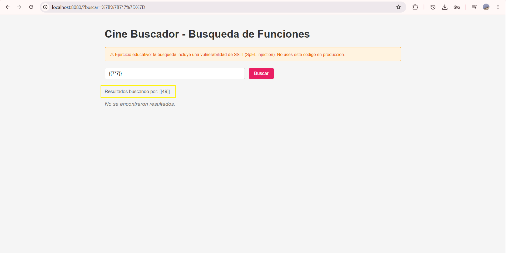

#### 4.3 Análisis del código
&emsp; Podemos empezar por encontrar el lugar en el cual se concatena la búsqueda al mensaje "Resultados buscando por: ". Esto se encuentra en el archivo `FuncionController.java`, donde podemos ver que lo que se concatena es el resultado del objeto de clase `SpelEvaluator`.

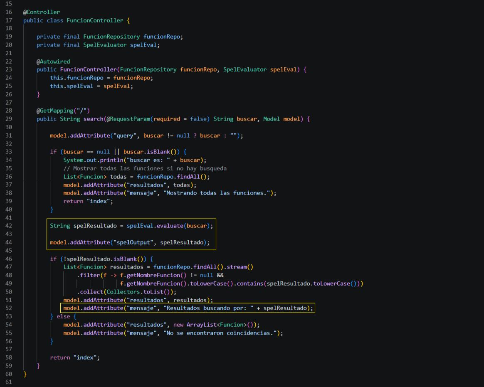
&emsp; Dentro del archivo `SpelEvaluator.java` podremos encontrar un método que utiliza un `ExpressionParser` y un `StandardEvaluationContext`. Esto genera que, en primer lugar, cualquier cadena que se pase como parámetro al objeto `SpelEvaluator` sea considerada una expresión SpEL y, por lo tanto, sea ejecutada. Por otro lado, el hecho de que se utilice un `StandardEvaluationContext` hace que las expresiones evaluadas tengan acceso a todo el lenguaje SpEL. Los contextos de evaluación estándar nunca deben ser utilizados con entradas que provengan del exterior del sistema.

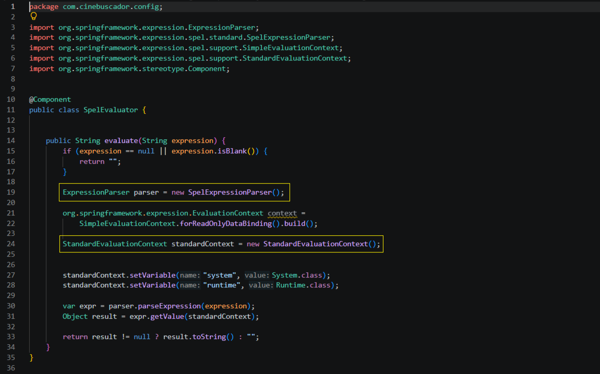

#### 4.4 Mitigación
&emsp; Por lo tanto, para comenzar a solucionar el código, debemos sanitizar la cadena que ingresa el usuario y usar un contexto de evaluación adecuado para la naturaleza de los parámetros que va a recibir.

&emsp; En primer lugar, agregamos una expresión condicional, que verifique si la cadena ingresada por el usuario está conformada exclusivamente de caracteres alfanuméricos. Si esto es verdad, podremos pasarle la cadena al `ExpressionParser` con mayor tranquilidad. De lo contrario, no se deberá regresar ningún resultado, y se deberá avisar que se ingresaron símbolos inválidos.

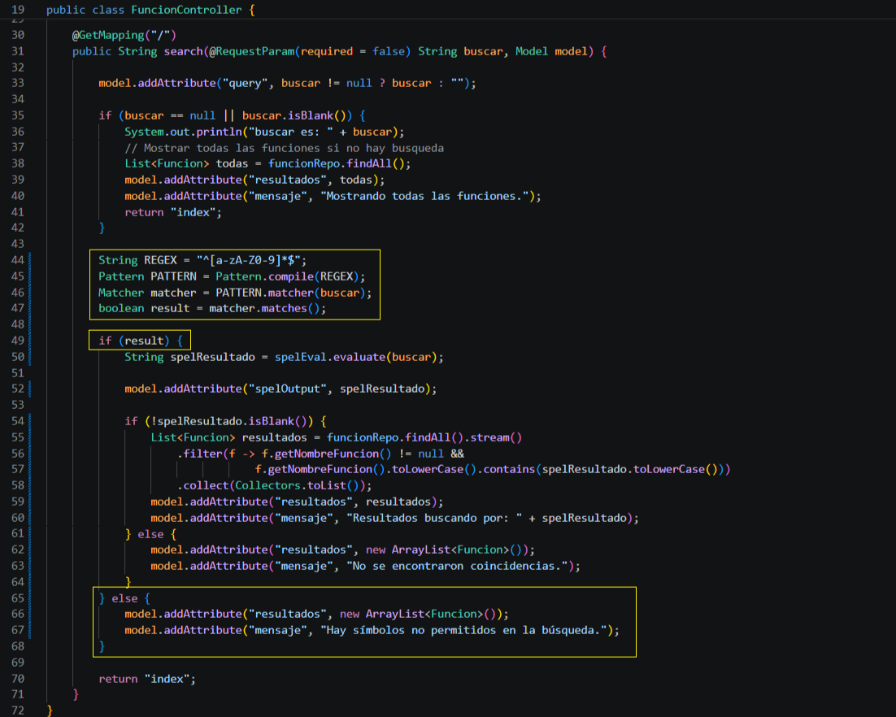
&emsp; Por otro lado, en el caso de SpelEvaluator, podemos hacer uso de la variable context ya creada en el archivo, y deshabilitar el contexto estándar.

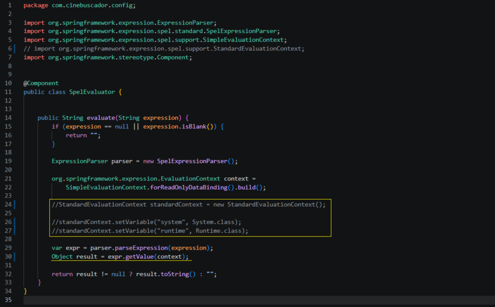
&emsp; Al probar nuevamente la aplicación, podemos ver que si cualquier expresión que contenga símbolos más allá de letras y números no va a generar una búsqueda ni tampoco se ejecutará ninguna operación.

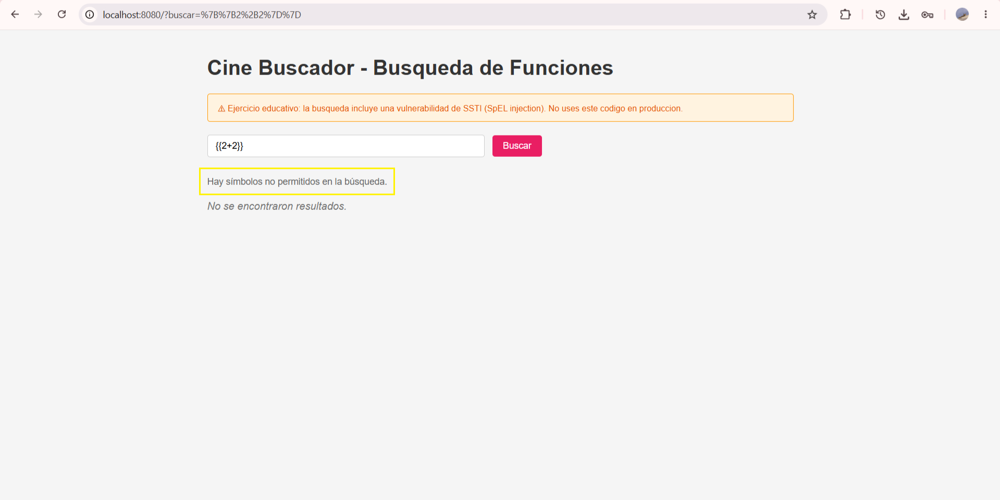

#### 4.5 Fuentes
**1.** https://xen0vas.github.io/Leveraging-the-SpEL-Injection-Vulnerability-to-get-RCE/# <br>
**2.** https://www.mgm-sp.com/en/blog-and-news/identifying-and-preventing-remote-code-execution-rce-with-spring-expression-language-spel/ <br>
**3.** https://www.baeldung.com/java-check-string-contains-only-letters-numbers

### 5. Almacenamiento inseguro
#### 5.1 Introducción
&emsp; El almacenamiento inseguro de información se refiere una debilidad donde información sensible es almacenada sin implementar medidas para protegerla. Por ejemplo, no controlar los permisos de lectura o escritura de diversos agentes sobre dichos datos.
#### 5.2 Demostración de la presencia de la vulnerabilidad
&emsp; En primer lugar, la plataforma nos pide regitrarnos. Luego de indicar nuestro usuario y nuestra contraseña, nuestra cuenta es creada y almacenada.

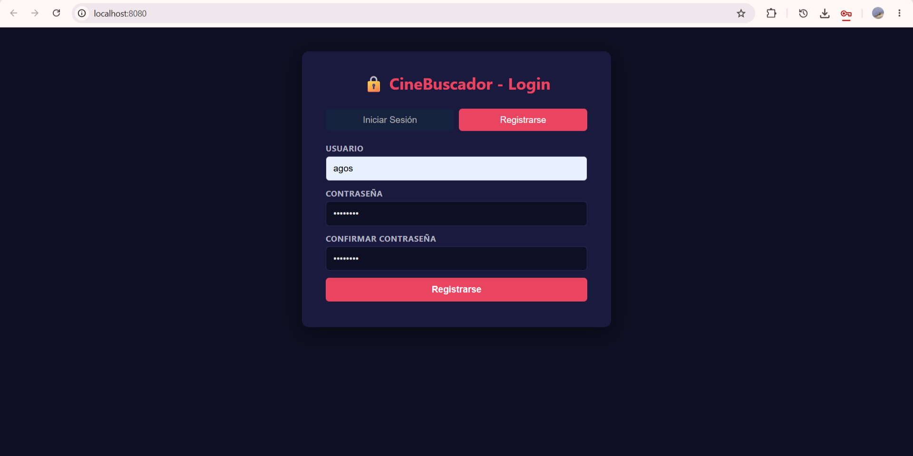
&emsp; Luego de registrarnos, podemos iniciar sesión con nuestras nuevas credenciales. Es de destacar que la contraseña no debe ser de ningún largo particular ni contener caracteres especiales, lo cual también perjudica a la seguridad del sistema.

&emsp; Una vez que iniciamos sesión, la plataforma nos devuelve nuestra contraseña encriptada.

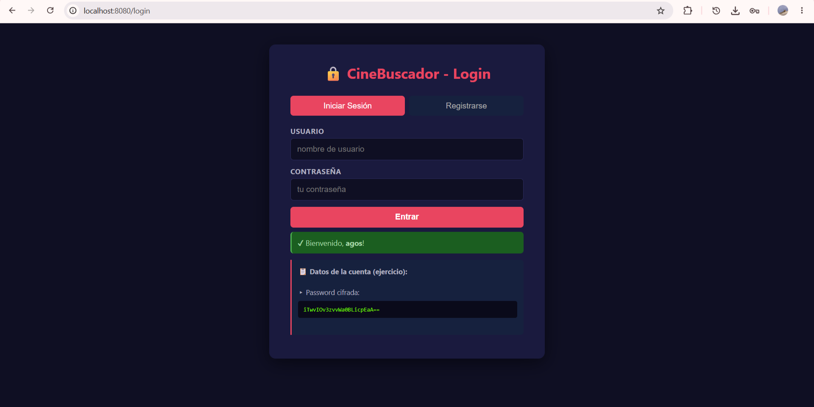

&emsp; Más importante, si creamos otro usuario con la misma contraseña, podemos ver que la encriptación generada es la misma para ambos usuarios.


```
- usuario agos: iTwvIOv3zvvWa0BLicpEaA==
- usuario agosdos: iTwvIOv3zvvWa0BLicpEaA==
```

&emsp; Solo con estas consideraciones podemos verificar que existe la debilidad de almacenamiento inseguro en el sistema. 

#### 5.3 Análisis del código
&emsp; En el archivo `EncryptionService.java` podemos encontrar varias vulnerabilidades que perjudican la seguridad de la aplicación.

**Clave embebida en el código**

&emsp; La clave utlizada en la encriptación de las contraseñas se encuentra embebida en el código fuente, por lo que cualquiera con acceso al código y al resultado encriptado de las contraseñas puede desencriptarlas.

&emsp; Esto es especialmente peligroso porque la aplicación devuelve el resultado de la contraseña encriptada una vez que se inicia sesión.

**Configuración ECB**

&emsp; La cadena de configuración de la encriptación se ve de la siguiente manera: `AES/ECB/PKCS5Padding`. 

&emsp; El problema está específicamente en la segunda configuración. El modo ECB genera el mismo texto cifrado para una misma entrada, lo cual puede dar lugar a análisis de patrones generados durante el proceso de encriptación.

&emsp; Por otro lado, el método de relleno `PKCS5P` está definido para bloques de 8 bytes, lo cual es más afín para algoritmos como DES.

**Métodos getter para clave**

&emsp; Existe un método que permite acceder a la clave de encriptación, uno para sus bytes y uno para obtener su equivalente en hexadecimal.

&emsp; Más allá de eso, el sistema tampoco pide al usuario una contraseña con ciertas consideraciones para aumentar la complejidad de la misma (como un largo mínimo, mayúsuculas, caracteres especiales, etc.). 

&emsp; Asimismo, la clave de encriptación se encuentra embebida en el código fuente, por lo que cualquiera con acceso a este y a cualquier contraseña almacenada puede recuperar la contraseña original.

&emsp; Finalmente, algoritmos de encriptación como AES ni siquiera son el estándar cuando se trata de contraseñas. Lo más recomendado es almacenar un hash de la contraseña y comparar este cada vez que se intente un inicio de sesión.

&emsp; Con esto en cuenta, podemos comenzar la mitigación de la debilidad.

#### 5.4 Mitigación
&emsp; En primer lugar, cambiaría la encriptación reversible por una función de hash. Para hacer esto podemos agregar a las dependencias el framework de seguridad y autenticación para Spring, Spring Security. El `pom.xml` queda de la siguiente manera:

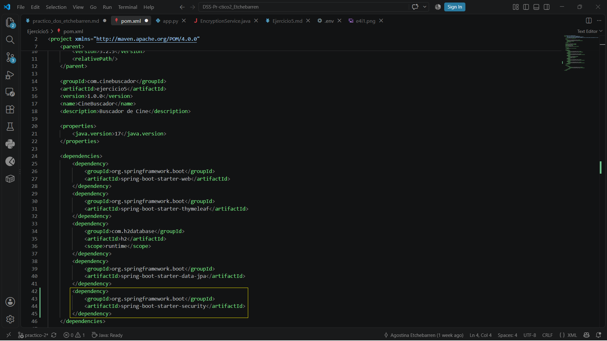

&emsp; Luego de esto podemos actualizar el archivo `EncryptionService.java`, de modo que tenga un método para encriptar y otro para comparar las contraseñas ingresadas en los intentos de inicio de sesión y el hash original almacenado.

&emsp; También deberemos cambiar la configuración de encriptación. Por ejemplo: `AES/GCM/PKCS7P`. A diferencia de ECB, GCM genera un vector de inicialización de modo que no haya patrones relevantes en la información encriptada generada por el proceso. Se recomienda que el IV sea de 12 bytes.
&emsp; Por otro lado, debemos deshabilitar los métodos getters para la clave de encriptación en sí, su versión en hexadecimal y sus bytes.

&emsp; Luego de implementar estos cambios podemos esperar un proceso de encriptación mas robusto y un sistema más resistente a ataques externos.

#### 5.5 Fuentes
**1.** https://support.google.com/faqs/answer/10046138?hl=en
**2.** https://medium.com/@thomas_40553/how-to-secure-encrypt-and-decrypt-data-within-the-browser-with-aes-gcm-and-pbkdf2-057b839c96b6
**3.** https://cwe.mitre.org/data/definitions/922.html
**4.**https://medium.com/@dowglasmaia/protecting-sensitive-data-with-java-21-modern-security-best-practices-f61d41a9a5ce
